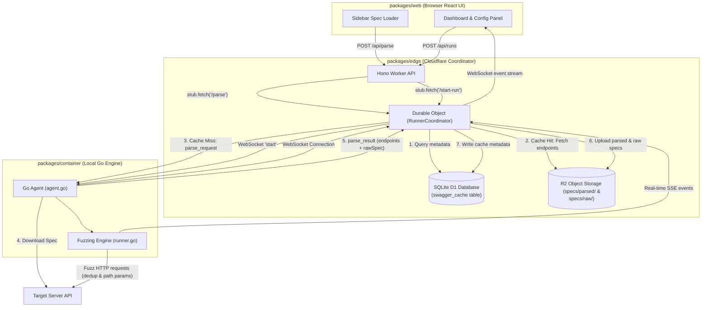

# ⚡️ swazz — CLI Context

This file provides essential context for the developer CLI to understand the `swazz` project structure, development workflows, and architecture.

## 🎯 Project Overview
**swazz** is a Smart API Fuzzer designed to identify crashes, logic flaws, and security vulnerabilities (like XSS or injection) by parsing Swagger/OpenAPI specifications and executing automated fuzzing runs.

### Core Architecture
The project is a hybrid repository using **npm workspaces** for the frontend and **Go modules** for the backend engine:
- **`packages/container`**: The core Go engine. Contains the HTTP API server (for the web dashboard), the CLI runner (`swazz-engine start`), the Smart Payload Generator, and output formatters.
- **`packages/web`**: A React 19 dashboard. Features a real-time Endpoint × Status heatmap, request inspector, and configuration management.
- **`packages/edge`**: Cloudflare integration (if applicable).

---

## 🏗 Swagger Cache & Fuzzing Architecture
We use a **hybrid caching design** to allow instant loading of endpoint trees on the frontend while avoiding SQLite (D1) database bloat from large Swagger specification files:

1. **SQLite (D1) Metadata Database**: Stores flat metadata like URLs, base paths, SHA-256 hashes of endpoints to check for structural updates, and keys referring to R2 storage files.
2. **Cloudflare R2 Object Storage**: Stores large payload objects including:
   - `specs/parsed/<ulid>.json`: Pruned endpoint trees ready for instant UI rendering.
   - `specs/raw/<ulid>.json`: Original raw specification files (JSON/YAML).
3. **Go Runner Agent**: Connected via WebSocket to the Edge Durable Object coordinator. Downloads and parses specifications on cache misses, sending them back to the coordinator for storage.

---

## 🛠 Tech Stack
- **Language**: Go (Backend), TypeScript/ESM (Frontend)
- **Frontend**: React 19, Vite, Vanilla CSS (CSS Variables)
- **Backend API**: Gin, standard `net/http`
- **Testing**: `go test` (Backend), Vitest (Frontend if any)

---

## 🚀 Key Commands

### Root Commands
- `npm install`: Install frontend dependencies.
- `npm run dev`: Starts the Go backend and Vite frontend concurrently.
- `npm run build`: Build the web dashboard.
- `npm run deploy:web`: Deploy the dashboard to Cloudflare Pages.
- `bash scripts/setup-dev.sh`: **One-time setup.** Symlinks the `swazz-toolkit` plugin.

### Backend Commands (in `packages/container`)
- `go run main.go serve`: Start the HTTP API server.
- `go run main.go start --config <path>`: Run the fuzzer in CLI mode.
- `go test ./...`: Run all backend tests.

---

## 🧠 Development Conventions

### Code Navigation & Search (RAG)
- **Prefer RAG tools**: For searching code or understanding file structures, prefer using the registered Model Context Protocol (MCP) tools:
  - `swazz_search_code` for semantic and keyword search across the codebase.
  - `swazz_get_file_context` for a structured outline of functions, types, and blocks in a specific file (conserves token usage instead of viewing full files).

### General
- **Go Best Practices**: The backend is written in Go. Ensure tests use `go test` and follow idiomatic Go conventions.
- **Web UI Types**: The web dashboard maintains its own `types.ts` to sync with the Go API JSON structures.
- **rtk Wrapper Auto-Detection**: Verification and testing scripts (such as `scripts/test-backend.sh`) check for the `rtk` wrapper. They execute standard `go` CLI directly if `rtk` is missing.

### Testing
- **Go Tests**: Always add unit tests in `packages/container/internal/...` for new fuzzing logic or generators. Tests should live alongside the files they test (e.g., `random_test.go` next to `random.go`).

### Styling (Web)
- **Vanilla CSS**: Avoid utility-first frameworks. Use `packages/web/src/index.css` for global variables and component-specific CSS files.
- **Theming**: Adhere to the established CSS variables (e.g., `--accent-light`, `--color-error`).

### CLI
- **Output Formats**: When adding findings or classifications, ensure they are reflected in `packages/container/internal/output/` (SARIF, JSON, HTML).

### CI/CD & Documentation
- **Selective Triggers**: GitHub Actions use path-based filters. `ci.yml` ignores meta files (README, etc.) and docs. `release.yml` conditionally builds components based on changes in `packages/`.
- **Documentation**: Use the `jekyll-theme-minimal` theme for `docs/`. Documentation is deployed via a dedicated `docs.yml` workflow when files in `docs/` change.

### Supply Chain Security
- **Strict Pinning**: Always pin external dependencies, GitHub Actions, Docker base images, and external scripts to specific commit SHAs or verifiable hashes (e.g. `actions/checkout@<sha>`). Never use mutable tags like `latest`, `master`, or `v1` to prevent supply chain attacks.

---

## 📁 Directory Structure
- `packages/container/main.go`: Entrypoint for both the server and CLI.
- `packages/container/internal/generator/`: Fuzz payload generation (`generator.go`) and static payloads (`payloads/`).
- `packages/container/internal/runner/`: The concurrent fuzz execution engine.
- `packages/container/api/`: Gin HTTP handlers for the web UI.
- `packages/web/src/components/`: React UI components (Dashboard, Heatmap, Inspector).

## 📊 Grouped Errors & Finding Categories
Findings detected by the backend analyzers are classified and grouped in the Web UI ("Grouped Errors" tab) and reports using the following rules defined in `packages/web/src/utils/findings.ts` and `packages/container/internal/analyzer/`:
- **`swazz/reflected-xss`**: Displays as **Reflected XSS** (Severity: `error`, Red). Triggered when a fuzzed XSS payload is reflected unescaped in the response.
- **`swazz/null-pointer-exception`**: Displays as **Null Reference Exception: [Language]** (Severity: `error`, Red). Detects language-specific null pointer dereferences (Java, Go, Python, C#/.NET, JS/Node, PHP, Ruby).
- **`swazz/sql-error-leak`**: Displays as **SQLi Error: [Database]** (Severity: `error`, Red). Detects database-specific SQL syntax errors (MySQL, Postgres, SQLite, MSSQL, Oracle).
- **`swazz/stack-trace-leak`**: Displays as **Stack Trace Leak: [Language]** (Severity: `warning`, Yellow). Detects stack traces from various framework call stacks.
- **`swazz/sensitive-data-leak`**: Displays as **Sensitive Data: [Category]** (Severity: `warning`, Yellow). Detects leaks of JWTs, AWS keys, private keys, API keys, or internal IPs.
- **`swazz/crlf-injection`**: Displays as **CRLF / Header Injection** (Severity: `error`, Red). Detects response header splitting.
- **`swazz/cors-misconfig`**: Displays as **CORS Misconfiguration** (Severity: `warning`, Yellow). Detects wildcard/reflected CORS origins.
- **`swazz/response-size-anomaly`**: Displays as **Response Size Anomaly** (Severity: `warning`, Yellow). Detects large variations in response size.

## Project Architecture & Refactoring Notes (Updated)
To maintain clean architecture, the application is strictly modular:
- **UI Components:** Kept as "dumb" as possible. Use `components/` for visual/layout logic (e.g., `MainWorkspace.tsx` manages internal application layout).
- **Complex UI State:** Handled by custom hooks in `packages/web/src/hooks/` (e.g., `useResizableLayout`, `useInspectorFilters`, `useToast`).
- **App Orchestration:** High-level app orchestration (like managing history or execution sessions) is done through domain-specific controller hooks (e.g., `useRunHistory`, `useFuzzSession`). Do not let `App.tsx` become a God Object.
- **Network & Business Logic (Frontend):** Separated into `packages/web/src/services/` (e.g., `swaggerService.ts`). Do not put `fetch` calls directly inside React components.
- **Payloads (Backend):** Static wordlists and payload definitions should be placed in `packages/container/internal/generator/payloads/`.

## 🤖 Autonomous Task Execution Protocol
When the user asks to "Do Task N" (e.g., "Сделай задачу 5") referencing the GitHub Project board (Project #7, owner `SecH0us3`), Antigravity CLI must automatically execute the following Human-in-the-Loop workflow:
1. **Find, Branch & Start**: Find the task on the GitHub Project board (`rtk gh project item-list 7 --owner SecH0us3 --format json`), locate its item ID, and immediately update its status to "In Progress" (option ID `47fc9ee4` for field `Status` `PVTSSF_lAHOAFg2Ls4BdsI1zhYL6f0` in project `PVT_kwHOAFg2Ls4BdsI1`):
   `rtk gh project item-edit --id <item-id> --field-id PVTSSF_lAHOAFg2Ls4BdsI1zhYL6f0 --project-id PVT_kwHOAFg2Ls4BdsI1 --single-select-option-id 47fc9ee4`
   Create a new git branch (e.g., `feature/task-N`).
2. **Plan**: Research the codebase and generate an `implementation_plan.md` artifact. **STOP** and wait for the user's explicit approval.
3. **Execute & Verify**: Write the code. Run unit tests (`scripts/test-backend.sh`). Ensure E2E validation against the Vulnerable Demo API (once Task 12 is complete).
4. **Review**: Run the automated Vibe code review script: `rtk ./scripts/vibe-review.sh < /dev/null`. Address any style/code violations in `docs/reviews/vibe-review.md`. Then generate a `walkthrough.md` artifact summarizing changes. **STOP** and request final human review.
5. **Complete**: After the user approves the walkthrough, set the task status to "Done" (option ID `98236657`):
   `rtk gh project item-edit --id <item-id> --field-id PVTSSF_lAHOAFg2Ls4BdsI1zhYL6f0 --project-id PVT_kwHOAFg2Ls4BdsI1 --single-select-option-id 98236657`
   and merge/commit changes.
