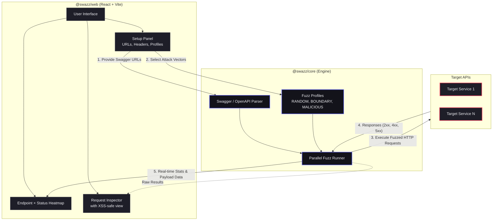

# ⚡️ swazz — Smart API Fuzzer

[](https://github.com/SecH0us3/swazz)

**swazz** is a modern, fast, and visual API Fuzzing tool. It automatically discovers your API surface by parsing Swagger/OpenAPI specifications and then blasts those endpoints with various unexpected, edge-case, and malicious inputs to identify breaking points, unhandled exceptions (5xx), and logic flaws.

 *(UI features a real-time Endpoints × Status Heatmap and Request Inspector)*

---

## 💻 CLI Usage

The `swazz` CLI allows you to run fuzzing tests directly from your terminal. This is useful for CI/CD pipelines or automated security scans.

1. **Configure your scan**:
   Create a `swazz.config.json` file. You can see examples below or use [swazz.config.example.json](file:///Users/alex/src/swazz/swazz.config.example.json) as a template.

### 📝 Configuration Examples

#### Minimal Configuration
```json
{
  "swagger_urls": ["https://petstore.swagger.io/v2/swagger.json"],
  "base_url": "https://petstore.swagger.io/v2",
  "settings": {
    "iterations_per_profile": 10,
    "profiles": ["RANDOM"]
  }
}
```

#### Full Configuration (with Auth & Rules)
```json
{
  "swagger_urls": ["https://api.example.com/swagger.json"],
  "base_url": "https://api.example.com",
  "headers": {
    "Authorization": "Bearer <your-token>"
  },
  "dictionaries": {
    "username": ["admin", "guest"],
    "productId": ["123", "456"]
  },
  "settings": {
    "iterations_per_profile": 50,
    "concurrency": 10,
    "profiles": ["RANDOM", "BOUNDARY", "MALICIOUS"]
  },
  "rules": {
    "ignore": [404, 401],
    "defaults": {
      "5xx": "error",
      "timeout": "error"
    }
  }
}
```

2. **Run the CLI locally**:
   ```bash
   # From the project root
   cd packages/cli
   npm start -- --config ../../swazz.config.json
   ```

3. **Options**:
   - `-c, --config <path>`: Path to your configuration file (required).
   - `-f, --format <fmt>`: Output format: `console`, `json`, `sarif` (default: `console`).
   - `-o, --output <path>`: Write the report to a file.
   - `-q, --quiet`: Suppress live progress output.
   - `--fail-on-findings`: Exit with code 1 if findings are found (useful for CI).

---

## 🚀 Quick Start

1. **Install dependencies** (the project uses npm workspaces):
   ```bash
   npm install
   ```

2. **Start the development server**:
   ```bash
   npm run dev --workspace=packages/web
   ```

3. **Open the Dashboard**:
   Go to `http://localhost:5173` in your browser.

4. **Run your first Fuzz Test**:
   - In the sidebar, enter one or more **Swagger URLs** (e.g., `https://petstore.swagger.io/v2/swagger.json`).
   - Add any required **Auth Headers** (e.g., `Authorization: Bearer <token>`).
   - Select your desired **Fuzz Profiles** (Random, Boundary, Malicious).
   - Press **Start** and watch the heatmap light up!

## 🚀 Cloudflare Deployment

You can deploy the application to Cloudflare (Pages + Workers) using `wrangler`. The application consists of a React frontend and a Cloudflare Worker proxy.

1. **Login to Cloudflare**:
   ```bash
   npx wrangler login
   ```

2. **Deploy the Frontend (Cloudflare Pages)**:
   ```bash
   npm run deploy:web
   ```

3. **Deploy the Proxy (Cloudflare Worker)**:
   ```bash
   npm run deploy:worker
   ```

4. **Link Custom Domain**:
   In the Cloudflare Dashboard, go to **Workers & Pages** -> **`swazz-web`** -> **Custom Domains**, and add your domain (e.g., `swazz.secmy.app`). The worker will automatically intercept `/proxy*` requests on this domain.

---

## 🧠 How it Works (General Architecture)

This is a monorepo containing two main packages: `@swazz/web` (Dashboard) and `@swazz/core` (Engine).



## 🤖 Claude Code Skills

If you use [Claude Code](https://claude.com/claude-code), the project includes slash commands for quick deployment:

- `/deploy` — build and deploy both worker and web
- `/deploy-worker` — deploy the CORS proxy worker only
- `/deploy-web` — build and deploy the frontend only

## 🛠️ Tech Stack
- **Frontend:** React, TypeScript, Vite, Vanilla CSS (CSS Variables for theming)
- **Engine:** TypeScript, native `fetch`
- **Proxy:** Cloudflare Worker (Hono)
- **Hosting:** Cloudflare Pages + Workers
- **Monorepo Management:** npm workspaces
