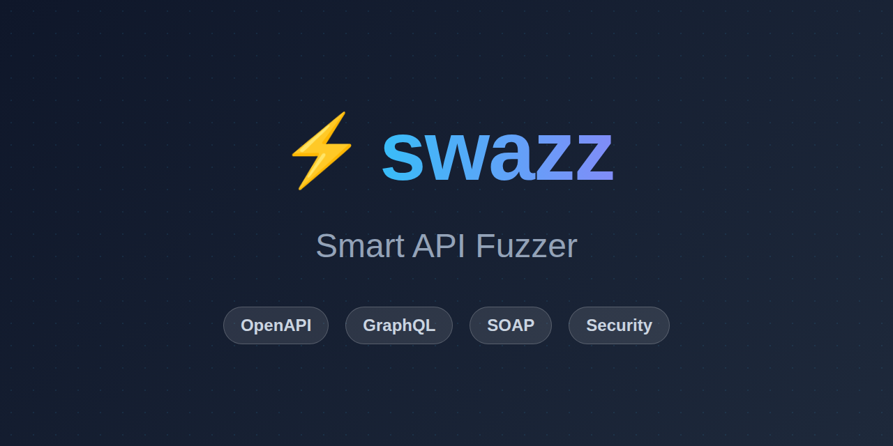

# ⚡️ swazz — Smart API Fuzzer


<p align="center">
  
</p>

[](https://github.com/SecH0us3/swazz/actions)
[](https://sarifweb.azurewebsites.net/)
[](https://mariadb.com/bsl11/)
[](https://SecH0us3.github.io/swazz/)

**swazz** is a modern, smart API fuzzer designed for security researchers and developers. It parses OpenAPI (Swagger) specifications (in both JSON and YAML formats), Postman Collections, and SOAP (WSDL) to automatically identify crashes, logic flaws, and security vulnerabilities (XSS, Injection, etc.) through intelligent payload generation.

---

## 📺 Live Demo Walkthrough

Watch **Swazz** in action as it registers a new user, loads an OpenAPI schema, fuzzes target endpoints, expands grouped findings, inspects a detailed SQL Injection error with mutation diff, and navigates project and user settings:

<p align="center">
  <video src="./docs/assets/swazz_demo.webm" width="800" controls autoplay muted loop></video>
</p>

---

## 🚀 Key Features

- **⚡️ Smart Fuzzing**: Context-aware payload generation based on parameter types and schemas.
- **🔄 Zero-Setup HAR Replay**: Import browser `.har` files directly for instant fuzzing of undocumented APIs and real-world workflows without needing an OpenAPI spec.
- **🔐 Auth Pipelines**: Support for complex, multi-step authentication sequences (login -> cookie collection -> fuzzing).
- **🛡️ Compliance Mapping**: Automatically map all discovered vulnerabilities to the **OWASP Top 10 (2025)** standard in reports and the Web Dashboard.
- **🎯 Precision Control**: Define custom rules to ignore specific status codes or elevate them to errors/warnings.
- **📊 Professional Reporting**: Export findings in **SARIF** (for CI/CD integration), **JSON**, or standalone **HTML** reports (now also accessible directly from the Web UI).
- **🔄 Multi-Scan Comparison**: Side-by-side analysis of scan runs to compare coverage metrics, HTTP status code distributions, and findings diffs (New, Fixed, and Common vulnerabilities).
- **🛠 Interactive Wizard**: Fast setup with `swazz-engine wizard` — no manual JSON editing required.
- 🌐 **Web Dashboard**: Real-time Heatmap, Request Inspector, and OWASP Compliance dashboard for deep-dive analysis.
- 🔔 **Real-Time Webhooks**: Deliver POST JSON payloads to external URLs on scan events and findings (see [Webhooks Guide](docs/webhooks.md)).
- 🤖 **MCP Server**: Expose Swazz commands, local codebase search, and scan findings natively through Model Context Protocol.

---

## 📦 Installation

### Download Binary
You can download the pre-compiled CLI binary from the [Releases](https://github.com/SecH0us3/swazz/releases) page for Linux, macOS, and Windows.

### Docker & Cloudflare
We publish two Docker images to the GitHub Container Registry:
- **API Server & Web Dashboard**: [ghcr.io/sech0us3/swazz](https://github.com/SecH0us3/swazz/pkgs/container/swazz)
- **Headless CLI Fuzzer**: [ghcr.io/sech0us3/swazz-cli](https://github.com/SecH0us3/swazz/pkgs/container/swazz-cli)

For detailed information about specialized CI and AI Auto-Fix images, please see the [Docker Deployment Guide](docs/docker_images.md).

For security reasons and to guarantee reproducibility, we **never use the `latest` tag**. Always use a specific commit SHA (replace `<COMMIT_SHA>` with the actual hash from our [Releases](https://github.com/SecH0us3/swazz/releases)).

#### Running the API Server (Web Dashboard)
```bash
docker pull ghcr.io/sech0us3/swazz:<COMMIT_SHA>
# The image exposes the backend service on container port 8080. Choose any host port you prefer:
docker run -p 8080:8080 ghcr.io/sech0us3/swazz:<COMMIT_SHA>
```

#### Running the Headless CLI
```bash
docker pull ghcr.io/sech0us3/swazz-cli:<COMMIT_SHA>
# Run fuzzing directly (mount your config file using a volume):
docker run --rm -v $(pwd):/app ghcr.io/sech0us3/swazz-cli:<COMMIT_SHA> --config /app/swazz.config.json
```

If you use this repository's compose setup, host ports are parameterized via FRONTEND_PORT (default: 3000) and BACKEND_PORT (default: 8081). See DOCKER.md for details.

#### Cloudflare Pages Frontend & External Backend (GCP / Cloud)
If you run the backend container on a cloud platform like GCP (Google Cloud Platform), you can host the client dashboard on Cloudflare Pages and proxy API requests to the cloud container.

To configure this:
1. Deploy the frontend to Cloudflare Pages using `npm run deploy:web`.
2. Configure the `API_URL` environment variable (or variable binding in your Cloudflare Pages dashboard) to point to your GCP backend instance (e.g., `https://swazz-api.yourdomain.com`).
3. The Cloudflare Pages worker will automatically proxy `/api/*` and `/health` requests to the configured `API_URL` to avoid CORS issues.

### Build from Source
```bash
# Clone the repository
git clone https://github.com/SecH0us3/swazz.git
cd swazz

# Build the engine
cd packages/container
go build -o swazz-engine .
```

---

## 🏁 Quick Start

### 1. Interactive Setup
Run the wizard to generate your configuration file automatically. It will guide you through Swagger URLs, Auth steps, and Rule definitions.
```bash
./swazz-engine wizard
```

### 2. Start Fuzzing
Execute the fuzzing run using your generated config.
```bash
./swazz-engine start --config swazz.config.json --html report.html
```

### 3. CI/CD Integration
Generate SARIF reports and fail the build if any security errors are found (perfect for GitHub Actions / GitLab CI).
```bash
./swazz-engine start --config swazz.config.json --fail-on-severity error --sarif findings.sarif
```

### 4. Stateful API Fuzzing & Request Chaining
Swazz can extract variables from previous responses and inject them into subsequent fuzzing requests (e.g., extracting an `AUTH_TOKEN` from a `POST /login` and injecting it as a header in later requests). Add rules via the Web Dashboard, or configure them manually:
```json
{
  "settings": {
    "chaining_rules": [
      {
        "source_endpoint": "POST /api/login",
        "extract_type": "json",
        "extract_path": "data.token",
        "variable_name": "AUTH_TOKEN"
      }
    ]
  }
}
```

### 5. Test on the Vulnerable Demo API
If you want to quickly test Swazz's capabilities, we provide a built-in vulnerable API simulated as a Cloudflare Worker in the `demo/` folder.
> **⚠️ Disclaimer:** The code in the `demo/` directory is intentionally designed with vulnerabilities (like SQL injection) for testing Swazz. It should **NOT** be used in production or audited for security issues.

### 6. End-to-End (E2E) Browser Testing
We have a suite of Playwright E2E browser automation tests that verify integration between the frontend dashboard, the Cloudflare coordinator, the Go runner agent, and the Vulnerable Demo API.

To run Playwright tests locally:
```bash
# Apply migrations for local D1 coordinator DB
npx --workspace=packages/edge wrangler d1 migrations apply swazz_db --local

# Start services (run each in background or separate shell session)
npm run dev --prefix demo -- --port 8788
npm run dev:backend
npm run dev:frontend
cd packages/container && go run main.go run-agent --coordinator ws://127.0.0.1:8787/api/runners/connect --dangerous-no-container

# Run the test suite
npx playwright install chromium
npm run test:e2e
```

---

## 🔐 Authentication & Administration

### 🤖 Service Accounts & Non-Interactive Users

Administrators can directly provision new user accounts or non-interactive service accounts from the **Members & Roles** project settings tab.
- **Service Accounts (Non-Interactive)**: Flagged as non-interactive (API-only) to completely restrict logging in through the interactive web dashboard. Upon creation, a permanent API key starting with `swazz_live_` is generated and displayed once. These credentials can be used directly with the Swazz runner agent or automated API scripts.
- **Interactive Users**: Provisioned directly with a secure temporary password displayed once to the administrator.

---

## 🔄 CI/CD Integration

Swazz is designed to work seamlessly in continuous integration pipelines. It supports exporting fuzz results to **SARIF (Static Analysis Results Interchange Format)**, allowing you to view and manage vulnerabilities directly inside your version control platform.

*   **GitHub Actions:** Automatically runs on pull requests, reporting findings inline on the files. See the [GitHub Actions Guide](docs/ci_cd.md#github-actions--sarif-reporting).
*   **GitLab CI:** Integrates directly with GitLab's Security Dashboard (via native SARIF or converted SAST reports). See the [GitLab CI Guide](docs/ci_cd.md#gitlab-ci).

For detailed setup instructions, including advanced configuration, caching, and credential injection, check out the full [CI/CD Integration Guide](docs/ci_cd.md).

---

## ⚙️ Configuration Example

`swazz` uses a flexible JSONC configuration (JSON with comments) for fine-grained control, allowing both single-line (`//`) and multi-line (`/* */`) comments:

```json
{
  "swagger_urls": ["https://api.example.com/swagger.json"],
  "base_url": "https://api.example.com/v1",
  "wordlist_files": {
    "xss": "custom_xss.txt",
    "sqli": "custom_sqli.txt"
  },
  "auth_sequence": [
    {
      "method": "POST",
      "url": "/login",
      "body": { "user": "admin", "pass": "secret" }
    }
  ],
  "rules": {
    "ignore": [404],
    "severity": {
      "200": "warning",
      "403": "error"
    }
  }
}
```

---

## 🛠 Tech Stack

- **Engine**: Go (High-performance concurrency)
- **Dashboard**: React 19, Vite, Vanilla CSS
- **Formats**: OpenAPI 2.0/3.0, Postman Collections, SOAP (WSDL), SARIF, JSON

## 🙈 Ignore Rules & Suppressions

To suppress false positives and filter noisy findings, Swazz supports ignore rules. You can triage findings in the Web Dashboard and download the rules config, or manually create `swazz.ignore.json` (which also supports JSONC comments) in your project root.

### Example `swazz.ignore.json`

```json
[
  {
    "rule_id": "swazz/reflected-xss",
    "endpoint": "/api/search",
    "method": "GET",
    "payload": "<script>alert(1)</script>"
  },
  {
    "endpoint": "/api/admin/*",
    "method": "DELETE"
  },
  {
    "rule_id": "swazz/status-500",
    "payload": ".*(sql|syntax|database).*"
  }
]
```

*   **`rule_id`**: Matches the Swazz vulnerability type (e.g. `swazz/sql-error-leak`, `swazz/reflected-xss`, `swazz/status-500`).
*   **`endpoint`**: Matches the request URL path (supports exact strings or wildcard `*` suffixes like `/api/admin/*`).
*   **`method`**: Matches the HTTP request method (case-insensitive).
*   **`payload`**: Matches the request body/parameters (supports regular expressions or substring matching).

---

## 📚 Documentation

Comprehensive documentation, including installation guides, usage instructions, and architecture details, is available at the [Official Swazz Documentation](https://SecH0us3.github.io/swazz/).

Key pages to explore:
*   [Installation Guide](docs/installation.md)
*   [Deployment Guidelines](docs/deployment.md)
*   [Usage & Configuration](docs/usage.md)
*   [Model Context Protocol (MCP) Guide](docs/mcp.md)
*   [CI/CD Integration Guide](docs/ci_cd.md)
*   [Architecture & Internals](docs/architecture.md)
*   [Security Review & Threat Model](docs/security_review.md)

---

## 🧩 Adding Custom Error Detectors

New developers can easily add custom finding categories and error signature rules to the scanner. Custom detectors are defined as regex patterns in a single central registry in the backend engine:
- Edit the [custom.go](./packages/container/internal/analyzer/custom.go) file.
- Append a new `CustomRule` to the `CustomRules` slice in that file:
  ```go
  var CustomRules = []CustomRule{
      {
          RuleID:  "swazz/custom-token-leak",
          Level:   "warning", // "error", "warning", "note"
          Name:    "Custom Token Leak",
          Pattern: `(?i)custom-api-token-[a-f0-9]{32}`,
          Message: "A custom API token leak has been detected in the response body.",
      },
  }
  ```
The engine automatically runs these rules against all HTTP responses and routes findings to the dashboard and exported reports.

---

## 🤝 Contributing

Contributions are welcome! Please feel free to submit a Pull Request.

---

## 🔒 Privacy & Data Deletion (GDPR)

Swazz supports self-service data deletion. Users can permanently and immediately delete their account, associated projects, scan histories, scan report files, and active runner connections directly from the **Danger Zone** section in the **Settings** panel. This ensures compliance with GDPR "Right to be Forgotten" policies.

---

## 📄 License

Distributed under the Business Source License 1.1. See `LICENSE` for more information.
