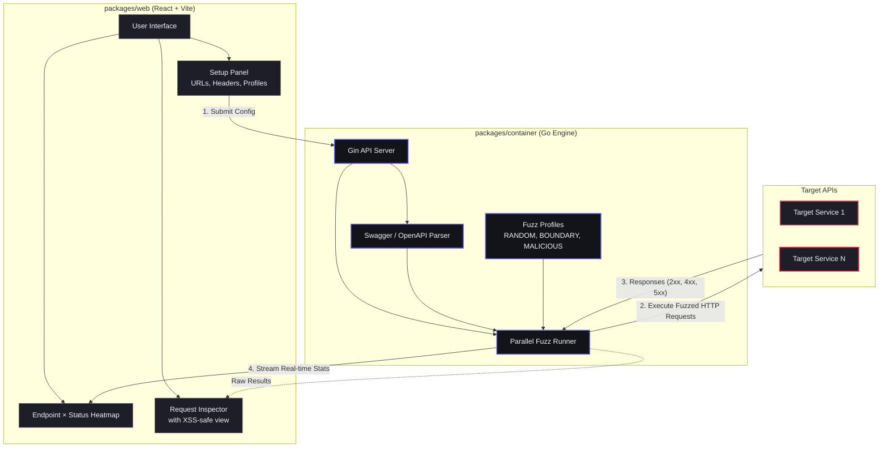

# ⚡️ swazz — Smart API Fuzzer

[](https://github.com/SecH0us3/swazz)

**swazz** is a modern, fast, and visual API Fuzzing tool. It automatically discovers your API surface by parsing Swagger/OpenAPI specifications and then blasts those endpoints with various unexpected, edge-case, and malicious inputs to identify breaking points, unhandled exceptions (5xx), and logic flaws.

 *(UI features a real-time Endpoints × Status Heatmap and Request Inspector)*

---

## 💻 CLI Usage

The `swazz-engine` CLI allows you to run fuzzing tests natively via Go directly from your terminal. This is highly performant and useful for CI/CD pipelines or automated security scans.

1. **Configure your scan**:
   Create a `swazz.config.json` file. You can see examples below or use [swazz.config.example.json](file:///Users/alex/src/swazz/swazz.config.example.json) as a template.

### 📝 Configuration Examples

#### Minimal Configuration
```json
{
  "swagger_urls": ["https://petstore.swagger.io/v2/swagger.json"],
  "base_url": "https://petstore.swagger.io/v2",
  "settings": {
    "iterations_per_profile": 10,
    "profiles": ["RANDOM"]
  }
}
```

#### Full Configuration (with Auth & Rules)
```json
{
  "swagger_urls": ["https://api.example.com/swagger.json"],
  "base_url": "https://api.example.com",
  "headers": {
    "Authorization": "Bearer YOUR_TOKEN_HERE"
  },
  "dictionaries": {
    "username": ["admin", "guest"],
    "productId": ["123", "456"]
  },
  "settings": {
    "iterations_per_profile": 50,
    "concurrency": 10,
    "profiles": ["RANDOM", "BOUNDARY", "MALICIOUS"]
  }
}
```

2. **Run the CLI locally**:
   ```bash
   # 1. Clone the repository
   git clone https://github.com/SecH0us3/swazz
   cd swazz

   # 2. Navigate to the Go container
   cd packages/container

   # 3. Run a basic scan
   # (The swazz.config.json file should be located in the project root)
   go run main.go start --config ../../swazz.config.json

   # 4. Generate reports in various formats (JSON, SARIF, HTML)
   go run main.go start --config ../../swazz.config.json --sarif reports/scan.sarif --json reports/scan.json --html reports/scan.html
   ```

3. **Options**:
   - `--config <path>`: Path to your configuration file (required).
   - `--sarif <path>`: Path to save SARIF output.
   - `--json <path>`: Path to save JSON output.
   - `--html <path>`: Path to save HTML output.

---

## 🚀 Quick Start

1. **Install dependencies**:
   ```bash
   npm install
   ```

2. **Start the development server** (starts both Go backend and Vite frontend):
   ```bash
   npm run dev
   ```

3. **Open the Dashboard**:
   Go to `http://localhost:5173` in your browser.

4. **Run your first Fuzz Test**:
   - In the sidebar, enter one or more **Swagger URLs** (e.g., `https://petstore.swagger.io/v2/swagger.json`).
   - Add any required **Auth Headers** (e.g., `Authorization: Bearer YOUR_TOKEN_HERE`).
   - Select your desired **Fuzz Profiles** (Random, Boundary, Malicious).
   - Press **Start** and watch the heatmap light up!

## 🚀 Cloudflare Deployment

You can deploy the application to Cloudflare (Pages + Workers) using `wrangler`. 

1. **Login to Cloudflare**:
   ```bash
   npx wrangler login
   ```

2. **Deploy the Frontend (Cloudflare Pages)**:
   ```bash
   npm run deploy:web
   ```

3. **Deploy the API (Cloudflare Worker)**:
   ```bash
   npm run deploy:api
   ```

---

## 🧠 How it Works (General Architecture)

This is a hybrid monorepo containing two main parts: `packages/web` (React Dashboard) and `packages/container` (Go Engine).



## 🛠️ Tech Stack
- **Frontend:** React, TypeScript, Vite, Vanilla CSS (CSS Variables for theming)
- **Engine:** Go (Gin, standard `net/http`)
- **Hosting:** Cloudflare Pages + Workers
- **Monorepo Management:** npm workspaces
