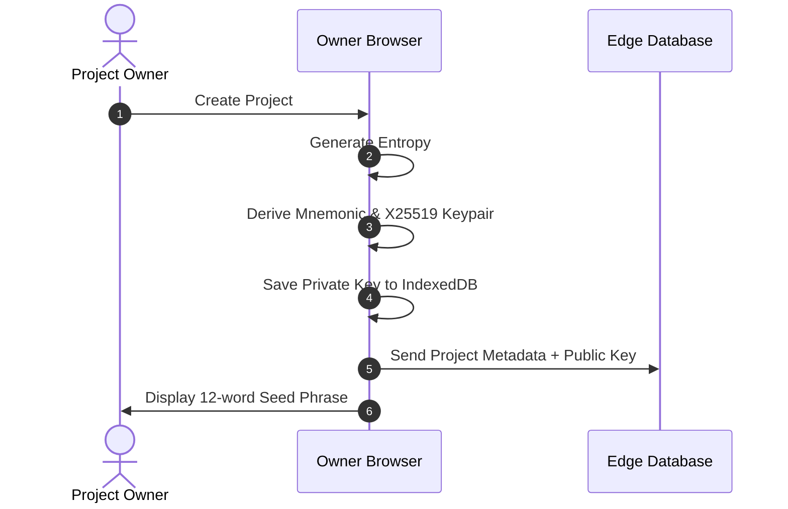
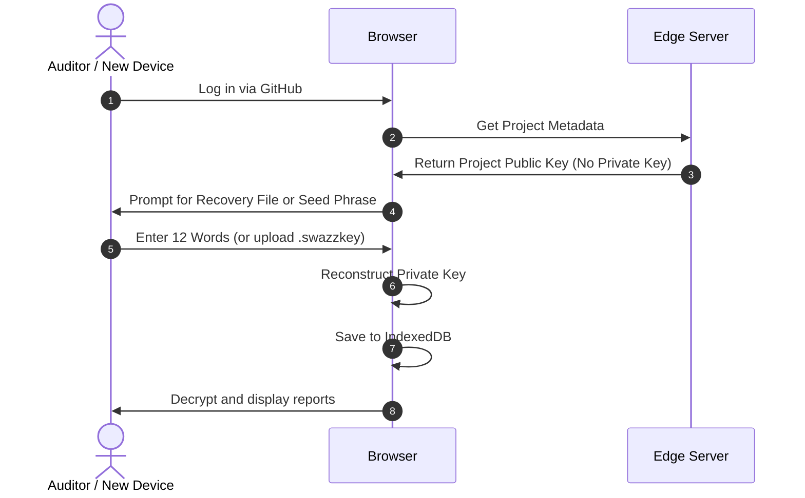

# End-to-End Encryption Key Backup & Recovery 🔑

To maintain a zero-knowledge architecture, Swazz scans and fuzzer reports are encrypted before they are stored on the server. Because the server only holds public keys, the private keys required for decryption reside strictly on the client side. 

To prevent loss of access to historical reports when changing devices, clearing browser storage, or inviting collaborators, Swazz implements **Project-Level E2EE Key Backup & Recovery**.

---

## 🏛 Why Project-Scoped (Not User-Scoped)?

In Swazz, scan reports belong to a **Project**, which can have multiple members (collaborators, security auditors, developers).
* If keys were user-scoped, inviting a new member would require re-encrypting all historical reports with the new member's public key, or the new member wouldn't be able to read old scans.
* **Project-Scoped Keys** solve this: Each project has a dedicated **Project X25519 Keypair**. 
* All reports in a project are encrypted using the project's public key.
* Collaborators share access to the project's private key. The private key is transferred securely or entered during setup.

---

## 💾 Backup & Recovery Mechanisms

Project owners can manage keys in **Project Settings > Encryption Keys**. Two recovery options are supported:

### 1. Mnemonic Seed Phrase (12 Words)
When a project is created, the system generates a 12-word mnemonic seed phrase (similar to BIP-39 in cryptocurrency wallets).
* **Derivation**: The 12 words are mapped back to a entropy seed, which is then fed into a PBKDF2 function to derive the X25519 private key.
* **Use Case**: Best for manual entry when logging in on a new device or sharing with a collaborator.

### 2. Backup File (`.swazzkey`)
Users can download a backup file containing the encrypted or raw private key.
* **Format**: A JSON file containing the JWK (JSON Web Key) representation of the X25519 private key.
* **Use Case**: Best for quick, automated imports.

---

## 🔒 Security Workflow

### 1. Owner Setup

### 2. Device Migration or Collaborator Invite

---

## ⚠️ Important Guidelines
* **Zero Server Knowledge**: The 12-word seed and backup files are processed **entirely client-side**. They are never sent to the Edge Coordinator or logged.
* **Loss of Keys**: If the owner loses both the seed phrase and the backup file, and clears their local browser storage, **historical encrypted reports cannot be recovered**. New keys can be generated, but old reports will remain permanently locked.
