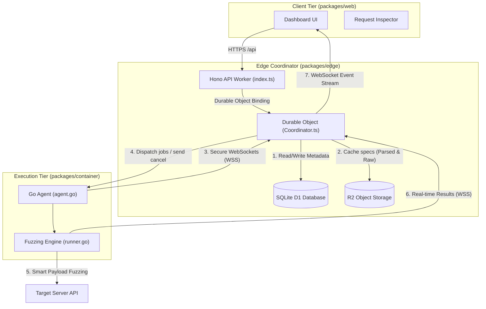
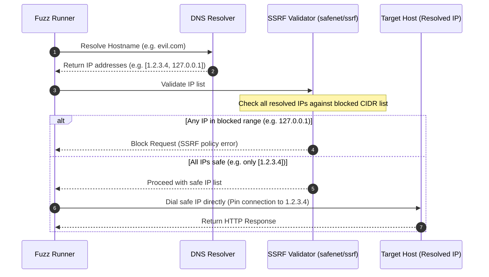
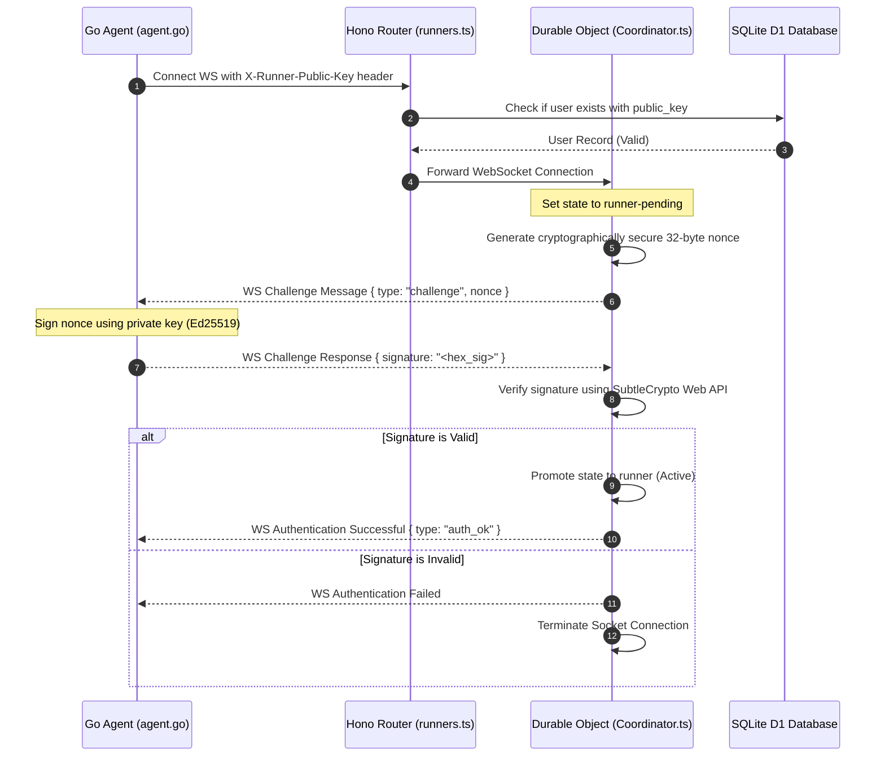

# Swazz Security Review & Threat Model 🛡️

This document provides a comprehensive security review and threat model of the Swazz Smart API Fuzzer. It details the trust boundaries, cryptographic protocols, mitigations against Server-Side Request Forgery (SSRF), agent authentication flows, and schema resolution safety measures.

---

## 1. System Architecture & Trust Boundaries

Swazz operates as a hybrid architecture divided into three main components:
1. **Web Dashboard (`packages/web`)**: The React-based frontend browser client.
2. **Edge Coordinator (`packages/edge`)**: A Cloudflare Hono Worker and Durable Object proxying commands, orchestrating runners, caching Swagger documents in Cloudflare R2, and storing metadata in SQLite D1.
3. **Go Runner Agent (`packages/container`)**: A high-performance execution engine running locally (CLI) or as a background service connected to the Edge Coordinator via WebSockets.

### High-Level System Architecture & Data Flows

### Trust Levels & Boundaries
- **User Dashboard to Edge API (HTTP/TLS)**: Users authenticate via username/password or token. Once authenticated, users can manage projects and trigger scans. Data access is restricted using row-level ownership checks (e.g. project/scan membership).
- **Go Runner Agent to Edge Coordinator (WSS/TLS)**: The agent executes in a potentially untrusted environment (e.g., local developer machines or shared runner networks). It must authenticate before being permitted to receive jobs or upload spec parses.
- **Go Runner Agent to Target API (HTTP/S)**: The fuzzer issues massive quantities of highly mutated and potentially malicious payloads. This outbound execution line is heavily guarded to prevent exploitation of the runner's own network.

---

## 2. Server-Side Request Forgery (SSRF) Protection

Because Swazz fetches OpenAPI specifications from user-supplied URLs and issues HTTP fuzzing requests to target systems, it is a high-value target for SSRF attacks. An attacker could register a target or supply a Swagger specification URL pointing to internal hosts (e.g., `http://localhost:8080/admin` or cloud metadata services like `http://169.254.169.254/latest/meta-data/`).

Swazz implements a **dual-layer SSRF mitigation engine** with DNS pinning to block these attacks.

### SSRF Protection Layers
1. **Cloud Agent Mode (`packages/container/internal/safenet/safenet.go`)**: 
   When running in cloud/agent mode, outbound connections to private, loopback, link-local, and unspecified addresses are blocked by default. 
   - Blocked CIDRs include: `10.0.0.0/8`, `172.16.0.0/12`, `192.168.0.0/16` (RFC 1918), `127.0.0.0/8` (Loopback), `169.254.0.0/16` (Link-local/Cloud Metadata), `::1/128` (IPv6 Loopback), `fe80::/10` (IPv6 Link-local), and `0.0.0.0/8` / `::/128` (Unspecified).
   - This check is bypassable for local debug setups only if `AllowLocalNetwork` is explicitly configured.
2. **Local CLI Mode (`packages/container/internal/security/ssrf.go`)**:
   Provides custom SSRF protection wrapping the standard Go transport. By default, it restricts access to private IPs unless `--allow-private-ips` is passed (defaulting to `false` in production environments, and configured via the `SWAZZ_ALLOW_PRIVATE_IPS` environment variable).

### DNS Rebinding & Pinning Flow
To prevent Time-of-Check to Time-of-Use (TOCTOU) DNS rebinding attacks (where a DNS entry resolves to a public IP during verification but returns a private IP during connection execution), Swazz handles resolution and dial routing explicitly:

---

## 3. Agent-to-Coordinator Security & Authentication

Shared agents connect to the Cloudflare Durable Object coordinator to accept scan jobs. To prevent rogue runners from hijacking work, stealing user configurations, or injecting false reports, Swazz supports **Ed25519 Cryptographic Challenge-Response Authentication**.

### Challenge-Response Flow

### Safety Features
- **Key Generation**: Agents generate keypairs via cryptographically secure randomness (`ed25519.GenerateKey(nil)` utilizing `crypto/rand`).
- **Auth Timeout**: The coordinator enforces a strict **5-second timeout** on pending handshakes. If challenge verification is not completed within 5 seconds, the WebSocket is forcefully closed to mitigate resource exhaustion attacks.

---

## 4. User Session & Identity Management

Authentication and session controls on the Web platform enforce the following security parameters:

- **Password Hashing**: Done via **PBKDF2 with SHA-256** using 100,000 iterations and a unique salt. The hashing and verification are performed on the server side using the Cloudflare WebCrypto API.
- **JWT Authentication**: Users receive a JSON Web Token (JWT) upon successful login, signed with a secure asymmetric key or environmental secret.
- **Failed Login Rate Limiting**:
  - Keeps track of failed login attempts by username and IP address.
  - Automatically locks out login capability for a user/IP after **5 failed attempts** for a duration of **15 minutes**.
- **Turnstile Verification**: The login and register pages validate a Cloudflare Turnstile token to deter bots and automated brute-force attacks.
- **Data Isolation**: Database queries validating project updates, scan retrievals, and deletions verify project membership using `checkProjectMembership` or scan membership using `checkScanMembership`.

---

## 5. OpenAPI Schema Processing Safety (OOM & ReDoS Mitigation)

Large, complex, or circular OpenAPI specifications can crash parsing tools via memory exhaustion (OOM) or stack overflows. Swazz protects its engine with the following limits:

- **DAG-based Resolution & Memoization**: References (`$ref`) are resolved and cached, transforming potential exponential-tree expansion into a Directed Acyclic Graph (DAG) with linear memory complexity.
- **Cycle Detection**: Active resolution paths are tracked on a recursion stack. Recursive loops are broken immediately, returning a fallback representation.
- **Node Budget**: Outlines a strict budget of **50,000 SchemaProperty nodes** per schema. Traversal is truncated if the budget is exceeded, saving the scanner from memory exhaustion.
- **Recursion Depth Limit**: A strict depth ceiling of **64** is enforced during schema expansion.

---

## 6. Supply Chain Security

To protect the Swazz project against supply chain compromises, the build and pipeline actions conform to strict configurations:

- **Pinned Actions & Base Images**: All GitHub Actions configurations and Dockerfiles pin dependencies and base images to specific, immutable SHA-256 commit hashes (rather than mutable version tags like `latest` or `v1`).
- **Dependency Audit**: The build process runs automated static code analysis (`gosec` for Go backend, npm security audit for frontend) to discover configuration vulnerabilities.
- **Excluded Rules**: The `.gosec.conf` excludes `G404` (use of weak random numbers). Since Swazz is a fuzzer, utilizing fast pseudo-random values (via `math/rand`) is required for payload variation speed. Cryptographically sensitive operations (challenge signatures, cryptographic nonces, etc.) bypass `math/rand` in favor of standard secure libraries (`crypto/rand`).
