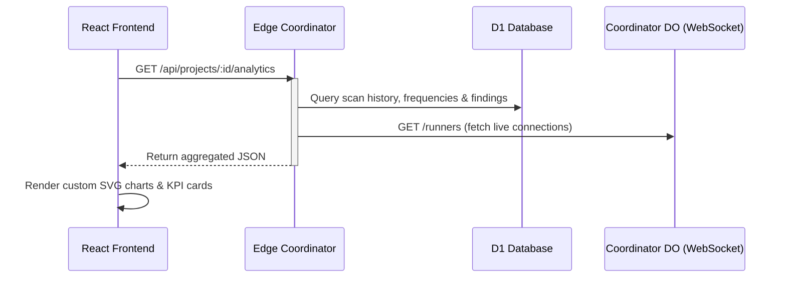

# 📊 Swazz Dynamic Analytics Dashboard Design Specification

This specification outlines the design and implementation of the **Dynamic Analytics Dashboard (Task 77)** for Swazz.

## 🎯 Goal
Provide visual insights into a project's fuzzing history, vulnerability trends, and runner performance over time in a dynamic dashboard.

---

## 📐 Architecture & Data Flow



---

## 🗄️ Backend API: `GET /api/projects/:id/analytics`

A new HTTP endpoint will be mounted on the Edge Coordinator in `packages/edge/src/routes/projects.ts`.

### Authorization
The endpoint will require project member read permissions, verified via `checkPermission(c.env, userId, projectId, 'get:/api/projects/:id/scans')`.

### D1 Database Queries

1. **Scan Statistics:**
   Calculates total runs, success ratios, and average duration of scans within the project.
   ```sql
   SELECT 
     COUNT(*) as total_scans,
     SUM(CASE WHEN status = 'completed' THEN 1 ELSE 0 END) as completed_scans,
     SUM(CASE WHEN status = 'failed' THEN 1 ELSE 0 END) as failed_scans,
     AVG(strftime('%s', completed_at) - strftime('%s', created_at)) as avg_duration_seconds
   FROM scans 
   WHERE project_id = ?
   ```

2. **Scan Frequencies Over Time (Daily):**
   Groups scans by calendar date for the last 30 days.
   ```sql
   SELECT 
     DATE(created_at) as date, 
     COUNT(*) as count,
     SUM(CASE WHEN status = 'completed' THEN 1 ELSE 0 END) as completed_count,
     SUM(CASE WHEN status = 'failed' THEN 1 ELSE 0 END) as failed_count
   FROM scans 
   WHERE project_id = ? AND created_at >= datetime('now', '-30 days')
   GROUP BY DATE(created_at)
   ORDER BY date ASC
   ```

3. **Vulnerability Severities & Categories:**
   Aggregates findings for all scans in the project.
   ```sql
   SELECT 
     f.level as severity,
     f.rule_id as category,
     COUNT(*) as count
   FROM findings f
   JOIN scans s ON f.scan_id = s.id
   WHERE s.project_id = ?
   GROUP BY f.level, f.rule_id
   ```

4. **Vulnerability Trends Over Time (Daily):**
   Tracks daily occurrence of findings grouped by severity over the last 30 days.
   ```sql
   SELECT 
     DATE(f.created_at) as date,
     f.level as severity,
     COUNT(*) as count
   FROM findings f
   JOIN scans s ON f.scan_id = s.id
   WHERE s.project_id = ? AND f.created_at >= datetime('now', '-30 days')
   GROUP BY DATE(f.created_at), f.level
   ORDER BY date ASC
   ```

### Runner Live Metrics
To get live runner utilization metrics, the API route will call the internal Durable Object endpoint `http://do/runners`.
- **Utilization Rate:** calculated as `(totalBusyRunners / totalConnectedRunners) * 100`.
- **Runner State:** runners are marked busy if `activeJobs.length > 0` in the DO state.

---

## 🎨 Frontend UI & Custom SVG Charts

A new page and tab `analytics` will be added in `packages/web/src/components/MainWorkspace.tsx` and `packages/web/src/store/appStore.ts`.

### 1. KPI Stats Cards (Glassmorphism layout)
- **Total Scans:** Displays the total scan count with a small sparkline trend.
- **Detected Vulnerabilities:** Displays total vulnerabilities with a badge highlighting critical severity.
- **Runner Utilization:** Circular progress gauge showing active vs idle runners.

### 2. Scan Frequencies (Interactive SVG Line Chart)
- **Grid Layout:** Custom SVG path coordinates calculated based on daily scan counts.
- **Visuals:** Purple/cyan neon gradient filling the area underneath the curve.
- **Interactivity:** Tooltip popup displaying the date and scan counts upon hovering over chart nodes.

### 3. Vulnerability Categories (SVG Bar Chart)
- Horizontal progress bars with rounded caps (`rx`).
- Styled with CSS variables (`var(--accent-light)`, `var(--success)`) for different severities.

### 4. Severity Breakdown (SVG Donut Chart)
- A multi-segmented circle utilizing `stroke-dasharray` and `stroke-dashoffset` for proportional slices.
- Visual legend pointing to Critical, High, Medium, Low categories.

---

## 🛠️ Testing Plan

### Backend Unit Tests
- Add test coverage in `packages/edge/src/index.test.ts` mocking project database entries and validating JSON response structures of `GET /api/projects/:id/analytics`.

### Frontend Component Tests
- Add a component unit test `packages/web/src/components/Dashboard/AnalyticsDashboard.test.tsx` verifying correct calculation of SVG points and segment coordinates.

### Playwright E2E Integration Tests
- Add E2E tests `tests/e2e/analytics.spec.ts` loading a mock fuzz result, verifying that the Analytics tab shows correct stats, and checking SVG element visibility.
