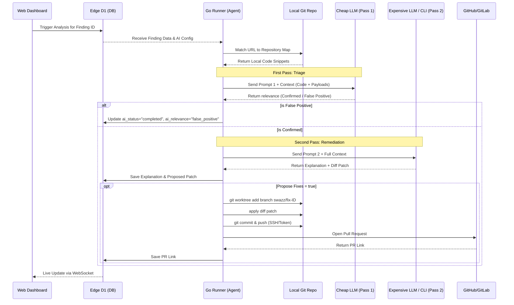

# Implementation Plan: Task 76 - AI-Based Findings Analysis with Local Repository Context

This plan details the step-by-step implementation for automatically analyzing, explaining, and fixing fuzzing findings using AI models (e.g., Claude, Gemini, or custom CLI agents) with context from the client's local repository.

## 📊 Data Flow & Sequence Diagram

---

## 🛠️ Step 1: Database Schema Migration (Cloudflare Edge D1)
Extend the findings table schema to store AI-generated explanation, remediation metadata, code diffs, pull request references, and repository mapping data.

1. **Create Migration:**
   - Add a new migration file under `packages/edge/migrations/`.
   - Add the following fields to the `findings` table:
     - `ai_status` (TEXT: `'none'`, `'analyzing'`, `'completed'`, `'failed'`)
     - `ai_relevance` (TEXT: `'confirmed'`, `'false_positive'`)
     - `ai_explanation` (TEXT)
     - `ai_remediation` (TEXT)
     - `ai_proposed_patch` (TEXT)
     - `pr_link` (TEXT)
2. **Update Edge Types & Queries:**
   - Update TypeScript interface definitions for findings in `packages/edge/src/types.ts`.
   - Update D1 query statements in findings handlers to retrieve/update these fields.

---

## 🔍 Step 2: URL-to-Repository Mapping & Code Indexer
Implement mapping configurations so that findings from different endpoints map to the correct repositories.

1. **URL to Repository Mapping:**
   - Allow configuration mapping (e.g., `/api/auth/*` -> `git@github.com:org/repo-auth.git`, `/api/goods/*` -> `git@github.com:org/repo-goods.git`).
   - Implement route-matching logic to determine the appropriate repository for each finding.
2. **Local Code Indexer (`packages/container/internal/analyzer/indexer.go`):**
   - Implement fast scanning of the resolved repository code to map the endpoint to specific source files and handler functions.
   - Extract code context (e.g., ±50 lines around the route/handler declaration) and relevant local structures/types.

---

## 🤖 Step 3: Multi-Stage LLM Client, Prompts & Custom CLI Execution
Build the AI engine interface to invoke cheap and expensive LLM models, or custom CLI agents like `claude -p` / `agy -p`.

1. **Two-Pass Analysis Configuration:**
   - **First Pass (Cheap Model):** Send finding details + code snippet to a fast/cheap model to triage the finding (`confirmed` or `false_positive`).
   - **Second Pass (Expensive Model):** If confirmed, send the data to a more capable model to generate an explanation, actionable remediation, and a unified diff patch.
   - Users must be able to configure specific system prompts for both the first pass (triage) and second pass (remediation).
2. **Custom CLI Agent Execution:**
   - Implement a CLI execution handler in the Go runner that can execute external commands like `claude -p {{prompt_file}}` or `agy -p {{prompt_file}}`.
   - The CLI handler will securely write the prompt to a temporary file, execute the configured command, and read the stdout/stderr responses to parse the model's output.
   - **Security:** Ensure `exec.Command` is used without spawning a shell to prevent injection, and only interpolate trusted system-controlled temporary file paths.
3. **Data Isolation Security:**
   - Wrap all untrusted finding metadata (payloads, responses) in XML tags (`<untrusted-finding-context>`) to prevent Indirect Prompt Injection, accompanied by strict system instructions.

---

## 🐙 Step 4: Automated Git Worktree, Patching & PR Creation
Provide automated code patching and repository synchronization, configured by a new "Propose Fixes" feature toggle.

1. **Git Credentials & Local Setup (Zero-Liability):**
   - Git and LLM credentials MUST NOT be stored in the Edge database or configured via the UI.
   - The user must launch the local runner with pre-configured environment variables (`GITHUB_TOKEN`, `GITLAB_TOKEN`, `ANTHROPIC_API_KEY`) or SSH keys existing in the host's `.ssh` directory.
   - The runner relies entirely on the local environment for permissions.
2. **Worktree-based Branching & Fixing:**
   - If "Propose Fixes" is enabled, the CLI runner will clone the relevant repository (based on the URL mapping).
   - Use `git worktree add` to create an isolated workspace for the fix without polluting the main clone.
   - Create a new branch (e.g., `swazz/fix-<finding-id>`).
   - Apply the unified diff patch generated by the LLM or agent.
3. **Validation & PR Creation:**
   - Optionally run verification scripts (e.g., `npm test`, `go test`).
   - Commit the changes and push the branch to the remote using the configured API tokens / SSH keys.
   - Create a Pull Request via GitHub/GitLab APIs and return the URL.
   - Clean up the worktree after success or failure.

---

## 🎨 Step 5: Web UI Visual Enhancements & Issue Tracking Integration
Build the dashboard panels to interact with AI-based reviews and configure agent settings.

1. **Project Config Updates (`packages/web/src/components/ProjectSettings/`):**
   - **AI Configuration Tab:** Add a dedicated tab to configure:
     - URL to Repository mappings.
     - Prompt definitions and settings for the two-pass models (cheap vs expensive).
     - Custom CLI command strings (e.g. `claude -p {{prompt_file}}`).
     - "Propose Fixes" checkbox toggle.
2. **AI Remediation Display:**
   - Integrate an "AI Insights" panel directly into the **Finding Inspector overlay / modal** (where the user clicks on a finding in the Anomalies tab).
   - Render:
     - Relevance badge ("True Positive" / "False Positive").
     - Markdown Explanation & Remediation.
     - Side-by-side Diff Viewer.
     - PR Links and local patch application status.
3. **Future Integrations Roadmap:**
   - Plan for future Jira, GitHub Issues, and GitLab Issues integration (allowing 1-click issue creation from the Finding Inspector).

---

## 📝 Step 6: Testing, Documentation & QA Audit
1. **Unit Testing:**
   - Add unit tests for the Go Indexer validating repository route resolution.
   - Test the CLI command executor and prompt parsing mechanisms.
2. **Verification & SAST:**
   - Run `scripts/test-backend.sh` to ensure Go compilation and safety checks pass.
3. **Documentation:**
   - Update `README.md` and `docs/` with instructions on setting up AI analysis, configuring URL mappings, providing SSH keys, and using custom CLI agents.
